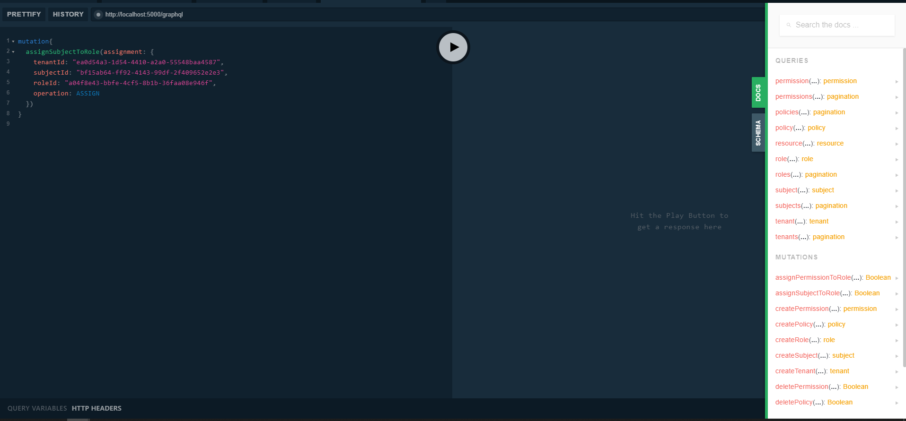
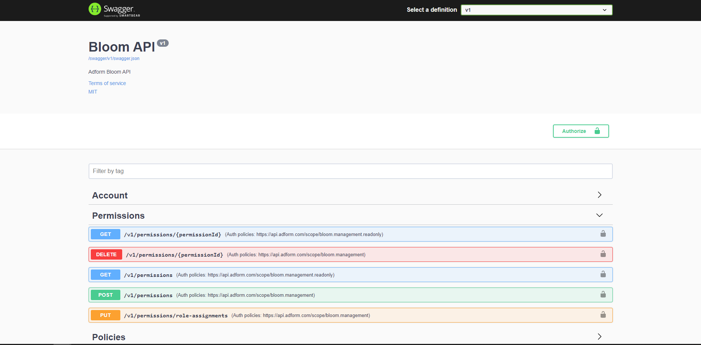

# Bloom Administration API

This service is responsible of all the mutations to the graph and the visibility management on the queries.

## Flavors

<figure class="thumbnails">
    
    
</figure>

### GraphQL

GraphQL server allows Query and Mutation over all the entities (Tenant, Subject, Policy, Role, Permission, Feature, Licensed Features).

#### Query [WIP]

**Payload**:


#### Mutation [WIP]

**Payload**:

```json
mutation CreatePermission($permission: PermissionInput!) {
  createPermission(permission: $permission) {
    name,
    description
  }
}
```

**Response**:

```json
{
  "data": {
    "createPermission": {
      "name": "demo",
      "description": null
    }
  }
}
```