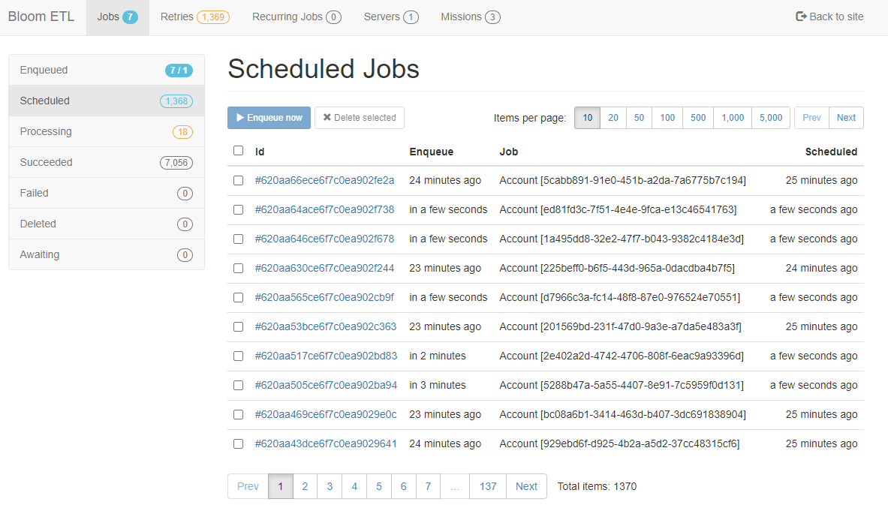

# Bloom ETL

This service is responsible for sinking DDP data from group `connect-sink-iam-k8s-neo4j-iam`. It is capable of sinking both Graph and SQL databases.

<figure class="thumbnails">
    
</figure>

## Use

`Bloom ETL` allows to:

* Seed a specific tier, building the graph in the process
* Outbox Pattern implementation at ddp sink

