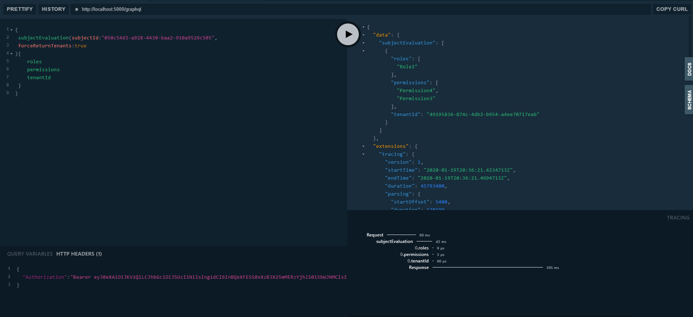
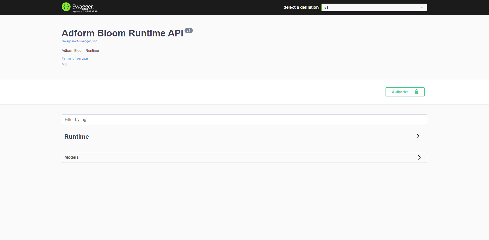

# Bloom Runtime API

## Flavors

<figure class="thumbnails">
    
    
</figure>

### GraphQL

GraphQL server allows Query over `subjectEvaluation`.

#### Query

The `subjectEvaluation` query contains the following structure.

```json
subjectEvaluation(
subjectId: ID!
tenantIds: [ID] = null
policyNames: [String]
tenantLegacyIds: [Int]
tenantType: String
inheritanceEnabled: Boolean = true
): [runtime]
```

**Payload**:

```json
{
 subjectEvaluation(subjectId:"050c54d3-a928-4430-baa2-910a9526c505"){
   	roles
   	permissions
  	tenantId
 }
}
```

**Response**:

```json
{
  "data": {
    "subjectEvaluation": [
      {
        "roles": [
          "Role2"
        ],
        "permissions": [
          "Permission4",
          "Permission3"
        ],
        "tenantId": "49195836-874c-4db2-b954-a4ee70717eab"
      }
    ]
  },
  "extensions": {
    "tracing": {
      "version": 1,
      "startTime": "2020-01-19T20:36:21.4234713Z",
      "endTime": "2020-01-19T20:36:21.4694713Z",
      "duration": 45793400,
      "parsing": {
        "startOffset": 5400,
        "duration": 120199
      },
      "validation": {
        "startOffset": 5400,
        "duration": 120199
      },
      "execution": {
        "resolvers": []
      }
    }
  }
}
```

### REST

The runtime endpoints allows to evaluate `Roles` and `Permissions` on a specific `Policy` or `Tenant`. Example:

**Path**:

```POST
/v1/runtime/subject-evaluation
```

**Payload**:

```json
{
  "subjectId": "050c54d3-a928-4430-baa2-910a9526c505",
  "tenantIds": [
  ],
  "policyNames": [
  ],
  "inheritanceEnabled": true,
  "forceReturnTenants": true
}
```

**Response**:

```json
[
  {
    "tenantId": "49195836-874c-4db2-b954-a4ee70717eab",
    "tenantName": "Tenant2",
    "roles": [
      "Role2"
    ],
    "permissions": [
      "Permission4",
      "Permission3"
    ]
  }
]
```

### Client & Middleware

To aid other teams with integration we provide two possible paths:

#### Client

This exposes the core http client and contracts for interacting with `Bloom Runtime`. It is compatible with `netstandard2.0`.

* https://gitz.adform.com/CIAM/adform-bloom-runtime/tree/master/src/Adform.Bloom.Runtime.Client

**Note** 

All the authentication and token retrival is not part of this and can be added on use basis.

### Middleware

This allows to have the `Claims` of the `HttpContext.User` to be enhanced by `Bloom Runtime` evaluation. Underneath uses `Adform.Bloom.Runtime.Client`, but due transformations on the claims among other process is currently compatible with `net6` and will be updated to the LTS of the framework.

* https://gitz.adform.com/CIAM/adform-bloom-middleware

