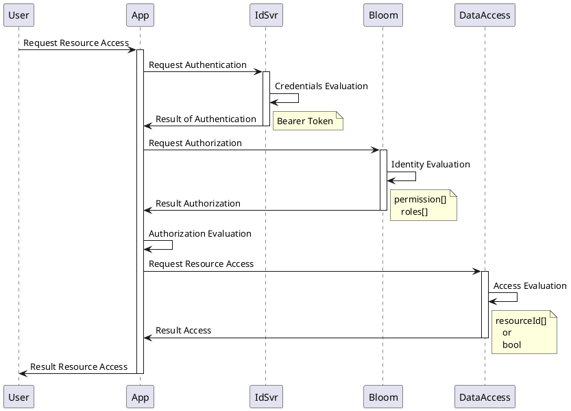

# Introduction

<a class="github-button" href="https://gitz.adform.com/CIAM/adform-bloom" data-icon="octicon-star" data-show-count="true" aria-label="Star CIAM/adform-bloom on GitHub">Star</a>

## Name 

Bloom name was choosen to reflect the use of graph technlogies. Bloom means to produce or yield blossoms, this is analogical to a graph database where of each node can produce offsprings to create hierarchies.

## Introduction

Bloom is a suite of components that provide authorization decoupling. Based on the premise of Policy and Tenant, the evaluation can be performed in specific context.

## Motivation 

Authorization and Access control are hard problems. Often for simple scenarios both of these problems are flatten and coupled with Identity and Authentication, which leads to major problems while scaling up a solution. 
Among the major problems that can occur is the saturation of the JWT, limitations on granularity of access among many others. To mitigate this problem is a good practice to keep these problems separate, and perform an orchestration between them as follows:

As observed in the example above the identity problem is solved first as the identity of the user is the same accross all the platform, whereas the authorization and access control are context specific, meaning that a user might have one role on one api but a different on another one. 

## Components

- **Authentication** 
Integrated with IdSvr3 and possible integration with IdSvr4.
- **Bloom.Admin.API** 
A service that contains REST and GraphQL endpoints. Documented with swagger and with Voyager
- **Bloom.Runtime.API** 
A service that contains REST and GraphQL endpoints. Documented with swagger and with Voyager
- **Graph.Database** 
An Open Source version of Neo4j called OngDB.
- **Graph.Management UI (coming soon)** 

## Features

- **Tenants** 
Tenant is a representative way of grouping subjects. The current implementation allows hierarchy of tenants. For more information [Tenants](terminology)
- **Subjects**  
Is a reference to the users, it allows assignments for subject evaluation. For more information [Subjects](terminology)
- **Groups**  
Is a reference to the roles from policy tree, it is an intermediate entity that exist to decouple tenant tree and policy tree. For more information [Groups](terminology)
- **Policies**
Policy is a module that has specific context and contains roles and permissions. For more information [Policies](terminology) 
- **Roles**
Role is a representative group of permissions. Roles are context specific. For more information [Roles](terminology)
- **Permissions**
Permissions are abstractions of actions that specific subject is able to perform in a specific context. For more information [Permissions](terminology)
- **Licensed Features**
Licensed Features allow to bundle the features. [License Features](terminology)
- **Features**
Features allow tenants to be able to assign permissions during role creation. For more information [Features](terminology)

## Contact & Support

- Create a [GitHub issue](https://gitz.adform.com/CIAM/adform-bloom/issues) for bug reports, feature requests, or questions
- Follow [#iam-graph]() for announcements
- Add a ⭐️ [star on GitHub](https://gitz.adform.com/CIAM/adform-bloom) to support the project!

<!-- GitHub Buttons -->

