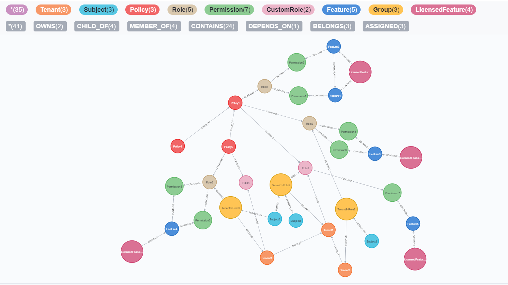

# Terminology

## Big Picture

<figure class="thumbnails">
    
</figure>

## Entities
### Tenant

A `Tenant` is the abstraction of `Business Accounts` allows to group `Subjects` and manage them.  A tenant can create `Roles` or called `Custom Roles` at any level of the `Policy` hierarchy tree.

#### Hierarchy

Each Tenant can have any number of child tenants allowing you to model not only multi-tenant applications but also complex organizational hierarchies.

?> **Tip** The `Tenant` Bloom identifier must be unique accross all the hierarchy

### Subject

A `Subject` is the abstraction of `User` of the platform. It usually counts with a unique identifier, a unique Bloom (aka userBloom). The `Subject` is assigned to `Roles` for authorization.

### Resource

A `Resource` is an abstraction of a business entity, to which access rules are applied. A resource can have a hierarchy for simplifying the access control. A resource for a `Tenant` can be `Subject`, `Role` or `Feature`. `Resource` as itself doesn't exist on the graph.

### Group

A `Group` is an abstraction of a role entity, it helps a role to be placed under the tenant tree.

### Policies

A `Policy` is a way to group or encapsulate `Roles` and `Permissions` that have similar context for authorization rules. It is identified by a Bloom, and that Bloom must be unique across its siblings. It is often used to model an application's specific authorization requirements.

#### Model 

A policy contains the following components:

- **Policy**.- by which it is referred in policy evaluation
- **Application Roles**.- used to group and assign users during evaluation
- **Permissions**.- granular list of Bloom permissions to be assigned through association to application roles.

#### Hierarchy

`Policies` can have any number of child policies, this allows a child to inherit the `Roles` that are defined on it's parent.

?> **Tip** The `Policy` Bloom identifier must be unique accross all the hierarchy

### Roles

`Roles` are used to group `Permissions` and are separated in two domains:
- Identity Roles.- A system Role that is given to the user after the authentication result, which is performed in one step before authorization.
- Application Roles.- An application contextual role that is part of the result of authorization.

### Permissions

`Permissions` are actions that are allowed to a `Subject` over certain `Resource`.

### Licensed Features

A `Licensed Feature` allows to bundle features for assigning features to `Tenants`.

### Features

A `Feature` allow to bundle permissions and scope their visibility to the `Tenant`. Features can have dependencies on other features, this co-dependency is useful to ensure that a `Licensed Feature` wont miss permissions requirements. 

## Mapping Terminology

    <table>
    <tr>
        <th>Term</th>
        <th>Buy Side</th>
        <th>Sell Side</th>
        <th>DMP Side</th>
        <th>IAM</th>
    </tr>
    <tr>
        <td>Business Account</td>
        <td>Agency</td>
        <td>Inventory Source</td>
        <td>Data Provider</td>
        <td>Business Account, Tenant</td>
    </tr>
    <tr>
        <td>User</td>
        <td>Master Account, Profile</td>
        <td>Master Account, Profile</td>
        <td>Master Account, Profile</td>
        <td>User, Subject</td>
    </tr>
    <tr>
        <td>Policy</td>
        <td>Project</td>
        <td>Project</td>
        <td>Project</td>
        <td>Product, Policy</td>
    </tr>
    <tr>
        <td>Role</td>
        <td>Role</td>
        <td>Role</td>
        <td>Role</td>
        <td>Role, Template Role, Transition Role</td>
    </tr>
    <tr>
        <td>Permission</td>
        <td>Permission</td>
        <td>Permission</td>
        <td>Permission</td>
        <td>Permission</td>
    </tr>
    </table>

## Access & Visibility

In the graph there are two types of scopes on which the data can be retrieved which are `Access` and `Visibility`. For more information [Access & Visibility](access-visibility) 

### Access

Is the scope in which a `Subject` can perform mutation operations to the entities.

### Visibility

Is the scope in which a `Subject` can perform query operations to the entities. As an example a `Subject` has access to the assigned `Roles` but his visibility includes that subset plus the `Roles` that the `Tenants` he belongs to own. `Visibility` is scoped also by hierarchy of the graph.

