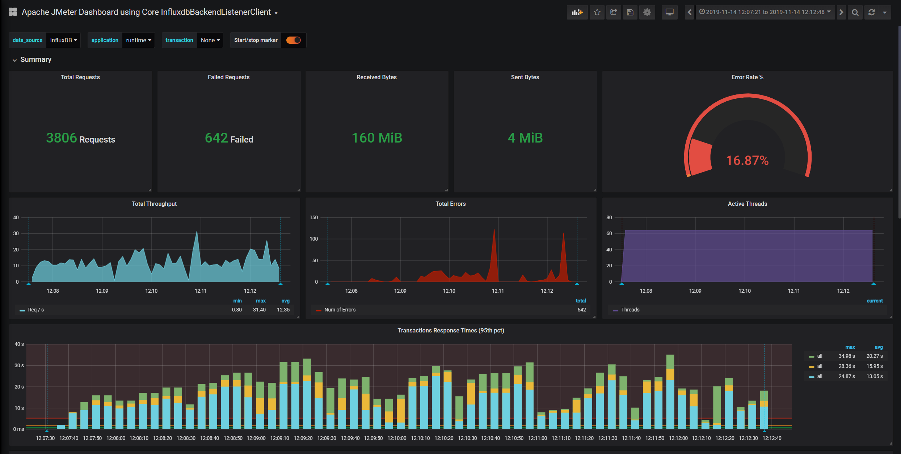
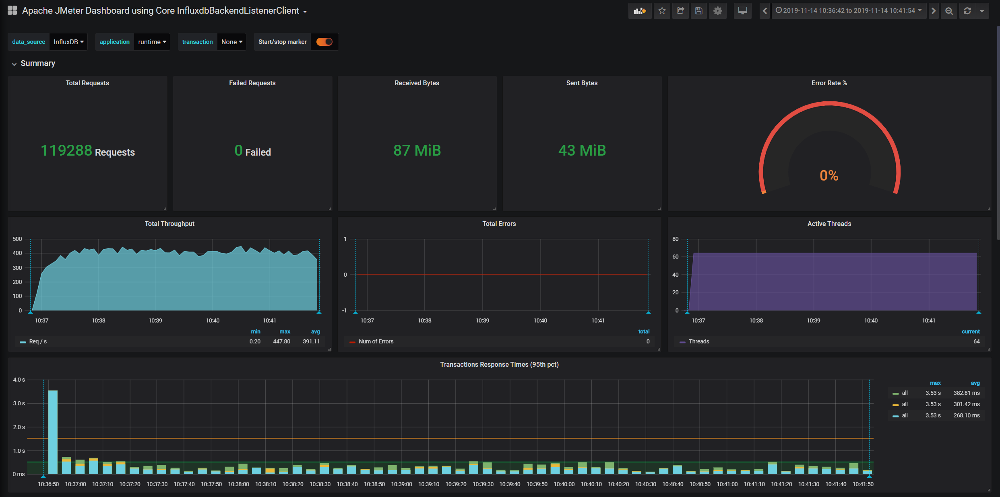

# Test (Initial one)

## Setup

### Database

**Hardware**

We used a single instance of OngDB (Neo4j Enterprise Open Source) with the following specs.

| Spec       | Value        | 
| ---------- |:------------:| 
| RAM        | 16GB         |
| VCPUs      | 4 VCPU       |
| Disk       | 50GB         |
| Disk (SSD) | 100GB        |

**Software**

| Spec       | Value        | 
| ---------- |:------------:| 
| ONgDB      | 3.5.11       |

## Results

**Test Settings**

| Spec       | Value        | 
| ---------- |:------------:| 
| Throughput | 600          |
| Duration   | 300          |
| Threads    | 64           |

**Policy Server**

| Entity     | Value        | 
| ---------- |:------------:| 
| Policy     | 16           |
| Role       | 1033         |
| Permission | 1600         |
| Tenant     | 342          |
| Assignment | 24990        |

<figure class="thumbnails">
    
</figure>

**BLOOM**

| Entity     | Value        | 
| ---------- |:------------:| 
| Policy     | 17           |
| Role       | 60926        |
| Permission | 364822       |
| User       | 1616000      |
| Tenant     | 4041         |
| Assignment | 45104397     |

<figure class="thumbnails">
    
</figure>

# Recent Tests

More test:

https://adform.atlassian.net/wiki/spaces/IAM/pages/1093994562/2020-02-07+Bloom+Runtime+load+tests
